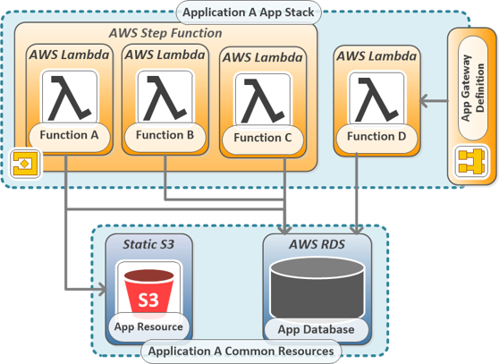
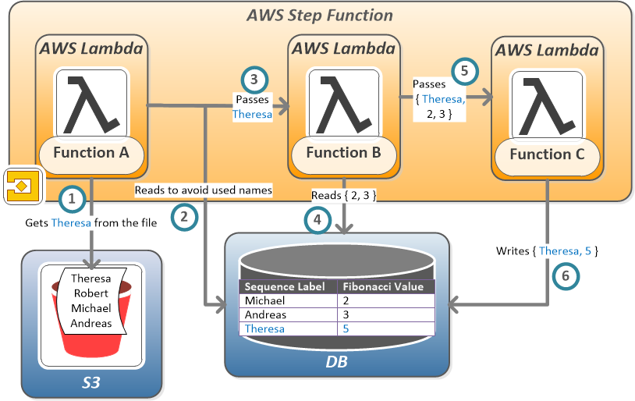
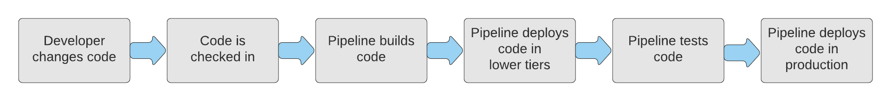

# Fibonacci sequence... with AWS CDK!
## Overview
This is a proof-of-concept project that demonstrates IaC AWS resource deployment using TypeScript development with CDK. The goals of this project are:
- Building a Pipeline using AWS CDK for application architectures defined using CDK
- Building a Pipeline to be used with multiple projects (easily added or removed)
- Deploying products composed of multiple deployable elements

All of the above resources will be launched and configured as a stack using the Cloudformation template created by CDK Toolkit. The `cdk.json` file tells the CDK Toolkit how to execute your app.

## Prerequisites
- S3 Bucket with a names.txt file, a list of words to be used as Sequence Label values; words are not repeated; they have no other meaning
- DynamoDB table with columns 'sequence_labels' and 'fib_values' must be created beforehand and configured in the .env file
- GitHub personal access token with the following scope: admin:repo_hook, repo, workflow
- Key for GitHub personal access token stored in AWS KMS

## Application Architecture

## Fibonacci Sequence Application
The following resources will be provisioned for the Fibonacci Sequence API created when running `cdk deploy`:
- Four Lambda functions:
    - Lambda A reads the File to find the last Sequence Label from the S3 and sends it onto Lambda B
    - Lambda B reads the last two Fibonacci Values entries from the DB and passes them, along with the new Sequence Label, onto Lambda C.
    - Lambda C adds the two numbers together and writes the new Fibonacci Value to the DB, labeling it with the Sequence Label
    - Lambda D lets you query the DB, returning the Fibonacci Value given for the Sequence Label, or returning the Sequence Label given for a given Fibonacci Value
- Step Function for running Lambda functions in order
- Cloudwatch Event for running Step Function once a day
- API Gateway that accepts POST requests for querying Fibonacci value associated with names and vice versa 

## CI/CD Pipeline
This API will be built and deployed using CodePipeline, also created with CDK, which will install npm packages, build this project, and synthesize the stack defined. A pre-prod environment will be set up for testing, and once successful, the application will be deployed in production. This process is triggered whenever changes are pushed to this repo's app-def folder.

## Useful commands

 * `npm run build`   compile typescript to js
 * `npm run watch`   watch for changes and compile
 * `npm run test`    perform the jest unit tests
 * `cdk deploy`      deploy this stack to your default AWS account/region
 * `cdk diff`        compare deployed stack with current state
 * `cdk synth`       emits the synthesized CloudFormation template
